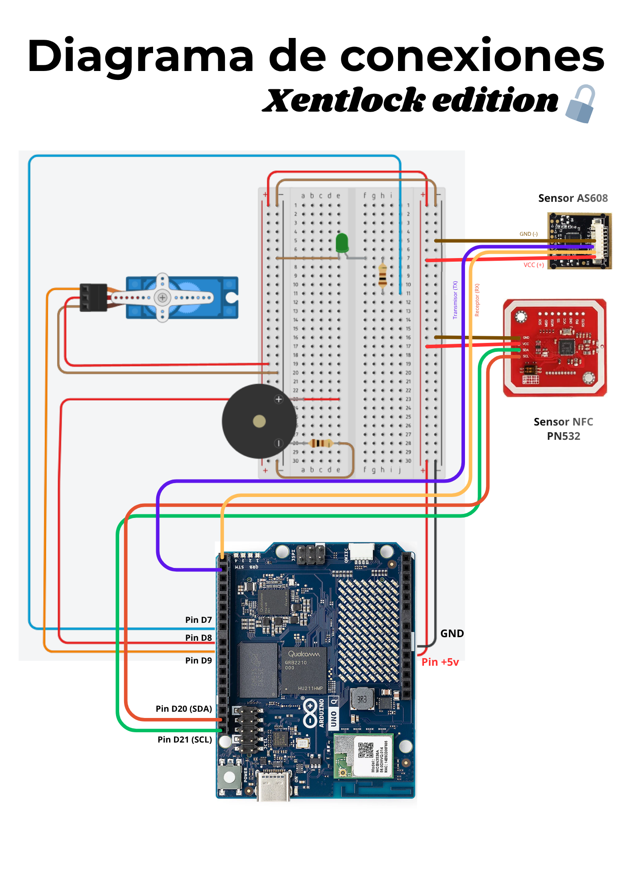

# PROY-2026-GRUPO 11

Repositorio del grupo 11 para el proyecto del ramo *Proyecto Inicial (IWG400)* – 2026.

## 👥 Integrantes del grupo

| Nombre y Apellido | Usuario GitHub            | Correo USM               | Rol USM      |
| ----------------- | ------------------------- | ------------------------ | ------------ |
| Vicente Pavez     | @xentopg                  | vpavezg@usm.cl           | 202510156-4  |
| Sebastián Martínez| @sseba07                  | smartinezt@usm.cl        | 202630019-6  |

## 📝 Descripción breve del proyecto

> Xentlock, es un dispositivo capaz de mantener seguras tus pertenencias, siendo este completamente digital, sin ranuras a llaves corrientes, solo es posible desbloquearlo mediante clave NFC, Huella digital o su Página web. El objetivo de este proyecto es reforzar la seguridad de un candado convencional, integrando funciones que un candado convencional no posee y eliminando sus vulnerabilidades físicas. Con las tecnologías utilizadas buscamos darle una opción más fresca y renovada a las personas ofreciendoles una alternativa extra, un dispositivo que no fuera complicado de usar y que poseea más de un método de desbloqueo en caso de emergencias. 

---

## 🔐Video de presentación
[https://youtu.be/0hnv8rGY4yY](https://youtu.be/0hnv8rGY4yY)

---

## 🎯 Objetivos

- Objetivo general:
  -Nuestro objetivo principal es rediseñar el candado convencional e implementar un sistema de control de acceso inteligente (utilizando Arduino Uno Q) que integre tecnologías de identificación para garantizar la mayor seguridad posible para un dispositivo de cierre físico (el candado), también incluyendo un sistema de alerta en caso de golpe o abertura no autorizada.

- Objetivos específicos:
  - Obtener los componentes necesarios. 
  - Aprender a utilizar Arduino Lab. 
  - Crear esquema de conexiones. 
  - Realizar las conexiones progresivamente para evitar percances. 
  - Programar el reconocimiento de los componentes por individual (PN532(NFC), AS608(Huella digital), microservomotor, buzzer). 
  - Identificar el código ID de las claves de acceso mediante un código.
  - Programar de claves de acceso en los sensores AS608 y PN532.
  - Establecer que las claves de acceso interactúen con el microservomotor y el buzzer.
  - Construir un código más complejo integrando los sensores y componentes programados previamente hasta completar el circuito final.
  - Configurar en el Arduino applab que se ejecute el código cuando el Arduino UNO Q recibe energía y de esta manera se pueda utilizar la powerbank como alimentación para el dispositivo.
  - Diseñar la base de pagina web para el proyecto con visual studio code.
  - Integrar la página web dentro del Arduino UNO Q para que esta sea capaz de correr en él.
  - Enlazar la placa con la interfaz web de manera que el Arduino Uno Q reciba la señal enviada desde la web e interactúe con la apertura del candado.
  - mejorar la Página web para que se pueda monitorear en tiempo real el estado del arduino y además registrar un historial de apertura.

---

## 🧩 Alcance del proyecto

> ¿Qué cubre?

Dentro de los aspectos que consideramos imprescindibles para llevar a cabo el prototipo de "Xentlock" estan:

-Autenticación dual por módulos 

*(Cuenta con la implementación de un sistema de apertura compatible tanto con huella dactilar como con el uso de NFC)* 

-Gestión de usuarios (localmente)

*(Capacidad de registrar, almacenar y validar diferentes huellas dactilares y etiquetas NFC autorizadas en la memoria local del sistema)* 

-Autonomía energética 

*(Powerbank de alta capacidad, lo que garantiza la portabilidad del prototipo y su funcionamiento inalámbrico)*

-Interfaz web

 *(Capacidad de abrir, cerrar y monitorear el candado en tiempo real desde una página web que esté vinculada con él)*

> ¿Qué limitaciones presenta? 

Por limtaciones de tiempo e inexperiencia al momento de programar y utilizar Arduino UNO Q tuvimos que dejar algunas de nuestras ideas en el papel y llegar a concretarlas(por el momento) como lo son:

-Resistencia climática 
 
 *(No hay certeza de que el prototipo pueda aguantar condiciones climáticas como por ejemplo la lluvia o temperaturas extremas)* 

-Duración de la batería 

 *(El prototipo si bien cuenta con una grán capacidad de batería esta es límitada, por lo que queda como desafío a futuro la optimización de la batería en general)*

-Aplicación independiente

 *(Otro desafío para resolver a futuro sería la vinculación del candado con una app, en la cual se pueda ver la batería restante, la gestión de las huellas, entre otras)*.
 -Diseño Final y comprimido

 *(Lograr obtener un diseño más compacto y que sea más fácil de transportar)*

 -Carga por pines magnéticos
 
 *(Tenemos contemplado que una carga por pines magnéticos podría reducir su posibilidad de sabotaje, como el uso de un USB killer)*

---

## 🛠️ Tecnologías y herramientas utilizadas

- Lenguaje(s) de programación:
  - Python, C++.
- Microcontroladores
  - Arduino UNO Q.
- Sensores
  - Sensor de huella Dactilar AS608, Sensor NFC PN532 
- componentes
  - Buzzer, led(verde), Servomotor MG996R, resistencia 100ohm
---

## 🗂️ Estructura del repositorio

```
/PROY-2026-GRUPO11
│
├── docs/               # Documentación general y reportes
├── src/                # Código fuente del proyecto
├── tests/              # Casos de prueba
├── assets/             # Imágenes, diagramas, etc.
└── README.md           # Este archivo
```

---

## 🚀 Instrucciones de Instalacion y Uso


1. **Clonar el repositorio:** `git clone https://github.com/xentopg/PLANTILLA-PROY-2026-GRUPO11.git`
2. **Dependencias:**
- [Instalar arduino applab](https://www.arduino.cc/en/software/)

**Una vez dentro de Arduino applab deberás registrar tu arduino asignandole una cuenta y contraseña**
`nota: si te pide actualizar a la ultima versión no es necesario, yo no tuve que hacerlo`
*Una vez instalado creas un proyecto y le instalar las librerias y bricks que aparecen aquí abajo:*

 -Librerías:
   Adafruit Fingerprint sensor library v2.1.3
   Adafruit PN532 v1.3.4
   Servo v1.3.0
   ezBuzzer v1.0.2
 -Bricks:
   WebUI-HTML
(se instalan desde el apartado "Add brick" y "Add library")
*vamos a necesitar editar el archivo sketch.yaml desde la terminal del Applab*
   
3. **Ejecución:**
  > Pasos a seguir:
  - Paso 1: Lo primero es, como fue mencionado anteriormente, tener instalado el Arduino Lab. Una vez dentro de este, debes abrir tu proyecto.
  
  - Paso 2: Tras la instalación de las librerías, se crearán unas carpetas llamadas "sketch" y "python". Ahora debes adiconalmente crear una carpeta llamada "assets"
  
  - Paso 3: Deberás copiar los archivos del repositorio que se ubican en la carpeta /src, Dentro de la carpeta que creaste manualmente(assets) irá el archivo "html", dentro de la carpeta python irá el archivo ".py", y dentro de la carpeta sketch (que se subdividirá en dos archivos) se deberá insertar el código ".ino" en su respectivo archivo (esta es la parte del microcontrolador en c++) y finalmente en el ".yaml" (que le explica al arduino cómo comunicarse con la web)vamos a tener que editarlo desde la terminal.
  
  - Paso 4: Para el "sketch.yaml", busca el ícono *>_* en la barra inferior izquierda, justo al lado del nombre de tu proyecto. Tras hacer click en este, se abrira una ventana con un fondo negro, esta será la terminal.
  
  - Paso 5: En la terminal deberas escribir el siguiente comando y ten en cuenta lo siguiente:
   I. En el comando, reemplaza NOMBRE-DE-TU-PROYECTO por el nombre exacto de tu proyecto tal como aparece en el Arduino AppLab.
   II. Comando: nano /home/arduino/ArduinoApps/NOMBRE-DE-TU-PROYECTO/sketch/sketch.yaml
   
  - Paso 6: Tras eso, se abrirá el archivo y deberás usar las flechas del teclado para moverte hasta el final, después de la línea que dice "default_profile: default."
  
  - Paso 7: Escribe exactamente esto (con espacios, no tabs):
   rpcs:
    name: abrir
    returns: void
    name: cerrar
    returns: void

  - Paso 8: Ahora presionas *Ctrl+O* para guardar, luego *Enter* para confirmar. Luego presiona *Ctrl+X* para salir del editor.
  - Paso 9: Para finalizar, en el Arduino appLab presiona *Stop* y luego *Run* (usualmente la primera vez que se ejecute se tardará en arrancar, pero conforme se va ejecutando el tiempo de iniciación se reduce drasticamente)
    
   > Notas adicionales:
   - Asegurarse que esté corriendo en 9600 baudios
   - Con los archivos del repositorio se deben copiar en sus respectivas carpetas dentro del proyecto en Arduino applab
   - El yaml no se puede editar directamente, por lo que si o si se debe hacer desde la terminal del Arduino abierta desde el Arduino Applab.
   - Si no sabes el nombre exacto de tu proyecto, puedes escribir este comando en la terminal para que te muestra todos los proyectos disponibles:
     ls /home/arduino/ArduinoApps/
---

## 📐 Diseño del Sistema


*Explicacion grafica de como es la conexion entre el microcontrolador y los sensores*

---

## 📅 Cronograma de trabajo

[Carta Gantt](https://usmcl-my.sharepoint.com/:x:/g/personal/vpavezg_usm_cl/IQCs5WCaG1q5TqvqJzvkhy9-AWukJlHdecXTcuYyGaN8mHM?e=p2jSog)

---

## 📚 Bibliografía

1. DroneBot Workshop. (2026). *Arduino UNO Q and Arduino App Lab v0.3.2* [Video]. YouTube. [https://youtu.be/6sGz3fy_xT4](https://youtu.be/6sGz3fy_xT4)

2. Arduino. (2026). *WebUI - HTML Brick Documentation*. Arduino App Lab v0.7.0. Documentación interna del panel del AppLab.

3. Arduino. (2026). *Ejemplo oficial blink-with-ui*. Arduino App Lab v0.7.0. Ruta interna: `/var/lib/arduino-app-cli/examples/blink-with-ui/`

4. Arduino. (2026). *Arduino_RouterBridge Library*. GitHub. [https://github.com/arduino-libraries/Arduino_RouterBridge](https://github.com/arduino-libraries/Arduino_RouterBridge)

5. Pallets Projects. (2024). *Flask Documentation*. [https://flask.palletsprojects.com](https://flask.palletsprojects.com)

6. Socket.IO. (2024). *Socket.IO Documentation*. [https://socket.io/docs](https://socket.io/docs)

7. cdnjs. (2024). *Socket.IO Client Library v4.7.2*. [https://cdnjs.cloudflare.com/ajax/libs/socket.io/4.7.2/socket.io.min.js](https://cdnjs.cloudflare.com/ajax/libs/socket.io/4.7.2/socket.io.min.js)

8. Adafruit Industries. (2024). *Adafruit PN532 NFC/RFID Library*. GitHub. [https://github.com/adafruit/Adafruit-PN532](https://github.com/adafruit/Adafruit-PN532)

9. Adafruit Industries. (2024). *Adafruit Fingerprint Sensor Library*. GitHub. [https://github.com/adafruit/Adafruit-Fingerprint-Sensor-Library](https://github.com/adafruit/Adafruit-Fingerprint-Sensor-Library)

10. Arduino. (2024). *Arduino UNO Q Documentation*. [https://docs.arduino.cc/hardware/uno-q](https://docs.arduino.cc/hardware/uno-q)

11. |Conversaciones con Gemini                                                                   |Conversaciones con Claude|
    |--------------------------------------------------------------------------------------------|--------------------------
    |[https://gemini.google.com/share/7a2621253fad](https://gemini.google.com/share/7a2621253fad)|[https://claude.ai/share/3dffba95-4a2a-42d5-a26a-e9908c0b58cb](https://claude.ai/share/3dffba95-4a2a-42d5-a26a-e9908c0b58cb)|
    |[https://gemini.google.com/share/ef1f6a7978c2](https://gemini.google.com/share/ef1f6a7978c2)|
    |[https://gemini.google.com/share/ea64b1a2190e](https://gemini.google.com/share/ea64b1a2190e)|
    |[https://gemini.google.com/share/652d6ab27d4f](https://gemini.google.com/share/652d6ab27d4f)|
    

---

## 📌 Notas adicionales

> *Espacio para dejar cualquier comentario útil, como pendientes, acuerdos del grupo, consideraciones especiales, etc.*

Como equipo consideramos que el prototipo creado es consecuente con lo planteado y es un gran avance en nuestra experiencia ya que logramos aprender bastante trbajando en ello, pese a los contratiempos y dificultades que enfrentamos como la falta de conocimiento acerca de electrónica y programación y el abandono de uno de nuestros compañeros, como equipo nos sentimos realizados con nuestro proyecto.
Aún así hay cosas tuvimos que dejar en el tintero por falta de tiempo, como por ejemplo implementar un modo que ahorre más energía e implementar una carga por pines magnéticos para evitar el uso de "USB killer" contra Xentlock, por parte de la web sería implementar metodo de cuentas y usuarios para que sea seguro abrir la página web a una red pública y de esta manera no sería necesario estar conectado a la misma red además de no perder control o seguridad al momento de utilizar el candado. 
